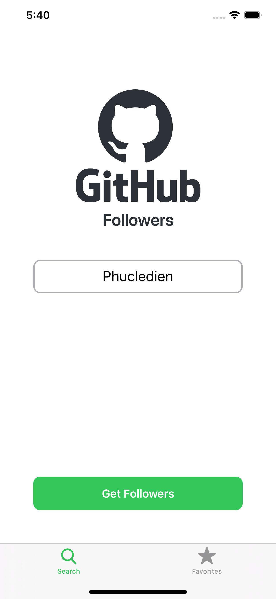
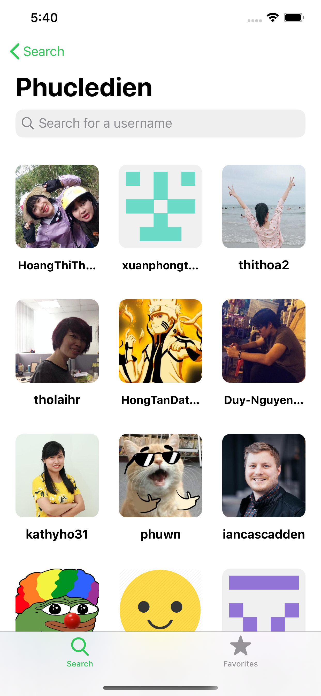

# Github followers app

Github iOS app for showing followers of a user

Make this app while follow Sean Allen course [here](https://seanallen.teachable.com/). Highly recommend it!

	
	

## Some cool things I have learned while making this app

- [x] UI programmatically using NSLayoutconstraint
- [x] UICollectionView with UIDiffableDataSource
- [x] Image caching using NSCache, better than using Dictionary (Auto deallocated item in cache when out of memory)
- [x] Making custom UICollectionViewFlowLayout
